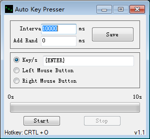
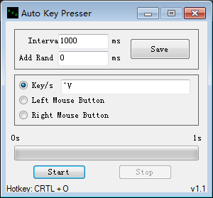

# auto-key-presser
Auto Key Presser is a simple C# .NET program I wrote that uses SendKeys to simulate keystroke/s or mouse presses at a settable interval.

It also features the ability to add a random amount of milliseconds to the interval to simulate the key press at slightly different times every time – thus bypassing basic anti-bot detection.

The timer can also be turned on/off via a global hotkey combination (Control + O) for use in games and other applications without having to tab out.

## Interface
The following image shows the program's interface:

As you can see, you can do these things to the focus windows:

- send keys
- simulate mouse click

## Send special keys
What to do if we want to send 'Enter'?

According to [MSDN](https://msdn.microsoft.com/en-us/library/system.windows.forms.sendkeys(v=vs.110).aspx), you just need to wrap those key by braces:

    {ENTER}

In addition, these characters have special meaning:

code|key
--|--
+|SHIFT
^|CTRL
%|ALT

So if you wanna send 'Ctrl + V', just type these text on the bar and then click start button:

    ^V

As the following screenshot shows:

Visit [this link](https://msdn.microsoft.com/en-us/library/system.windows.forms.sendkeys(v=vs.110).aspx) for more informations.
